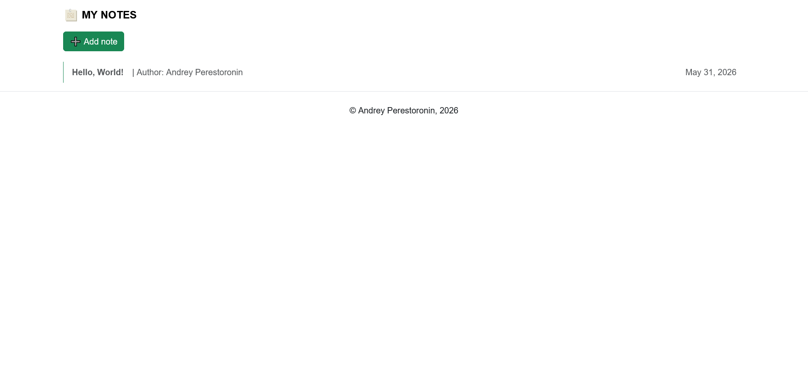
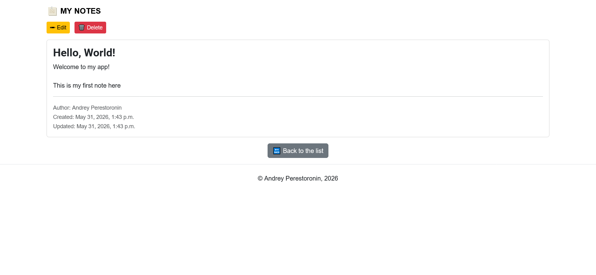
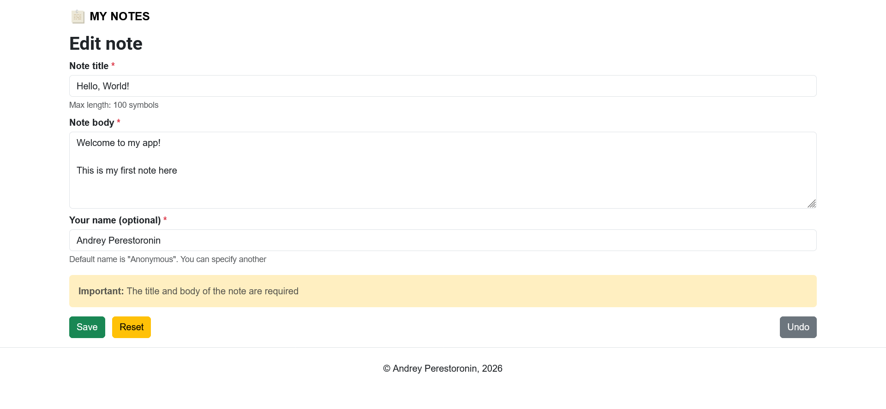
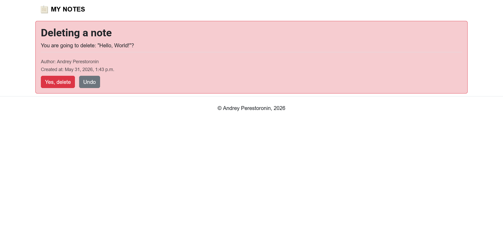

# Django Notes App

A note-taking web application built with Django 6.

## Features

* Create notes
* View notes
* Edit notes
* Delete notes
* Bootstrap 5 UI
* Author field
* Creation and update timestamps

## Tech Stack

* Python 3
* Django 6
* Bootstrap 5
* SQLite

## Installation

Clone repository:

```bash
git clone https://github.com/prs2rnn/django-notes-app.git
cd django-notes-app
```

Create virtual environment and install dependencies:

```bash
poetry install
```

Apply migrations:

```bash
make migrate
```

Run server:

```bash
make run
```

Open:

http://127.0.0.1:8000/

## Screenshots






## Future Improvements

* User authentication
* Search
* Categories
* Tags
* Pagination
* REST API
